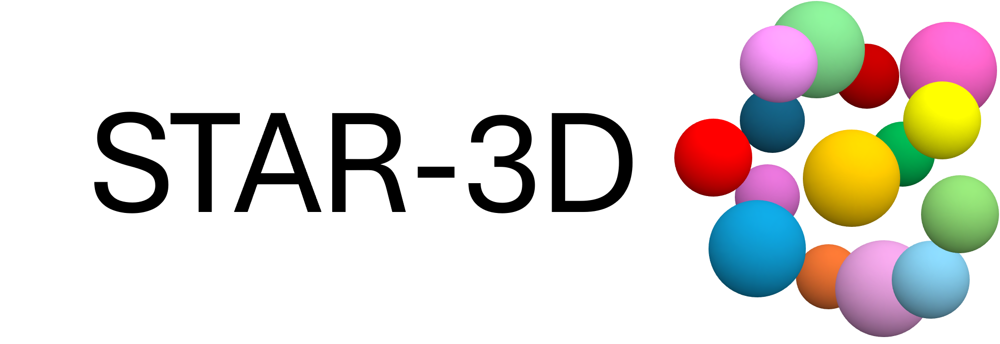
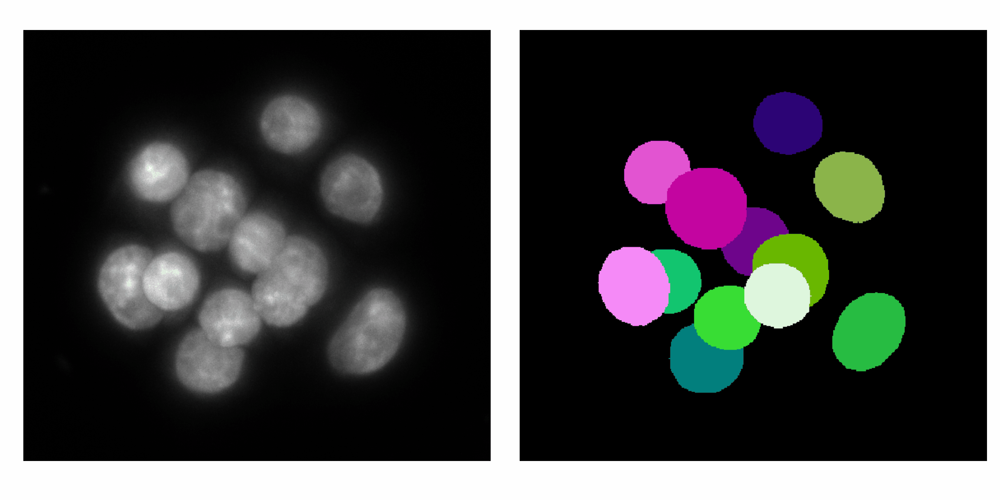

<p align="center"></p>

*Copyright (c) 2023-2024 Anita Karsa, University of Cambridge, UK*

*STAR-3D is distributed under the terms of the GNU General Public License*

ABOUT
-------------------------------------------------------------------------------
STAR-3D (STardist-based network for AnisotRopic 3D images) is a trained StarDist-3D-based 
network for 3D nucleus segmentation in highly anisotropic images. The network was trained on 
annotated mouse embryo images (close to 100 time points) acquired using light-sheet microscopy 
with an in-plane resolution of 0.174 um and a through-plane resolution of 2 um. 

The network (U-Net) was configured with 4 layers, convolutional kernels of size (3,4,4) and 
pooling kernels of size (1,2,2) to ensure a large enough, anisotropic receptive field. On top 
of the built-in augmentation methods of flipping and intensity change, random rotations 
between ±45 degrees about the through-slice axis (i.e. in plane) was added.
See src/star-3d/StarDist_3D_training.py for more details on the network configuration and training.

Our companion method for optimal cell tracking is downloadable from: https://github.com/akarsa/optimal3dtracks



HOW TO USE
-------------------------------------------------------------------------------
First, install required packages (see dependencies).

**To perform 3D nucleus segmentation** (see src/example.ipynb and src/example.py):

```
# 1. Calculate optimal resolution and downsampling factors 
resolution = np.array([2,0.174,0.174]) # in um
# We have found the network to perform optimally when the objects to be detected are about 5 voxels in the lateral direction
# and 60 voxels axially
expected_object_diameter = 10 # um
optimal_resolution = expected_object_diameter/np.array([5.0,60.0,60.0])
downsampling = resolution/optimal_resolution

# 2. Load network
model = StarDist3D(None, name='star-3d', basedir= './')

# 3. Load and preprocess intensity image    
intensity = imread(file,is_ome=False)
X_norm = norm_X(intensity,downsampling,1.0)

# 4. Perform segmentation in patches due to large RAM requirements of the network
patches = np.array([1,2,2]) # increase if tensorflow returns out-of-memory error
margins = 40/(resolution/downsampling) # we expect the nuclei to be no more than 40 um in diameter
Y_pred = patch_segmentation(X_norm,model,patches,margins)
Y_pred = scipy.ndimage.zoom(Y_pred,np.asarray(intensity.shape)/np.asarray(X_norm.shape),order = 0)
```

**For additional filtering and display features** (see src/example.ipynb):


HOW TO ACKNOWLEDGE
-------------------------------------------------------------------------------
@software{star-3d,

  author       = {Anita Karsa},

  title        = {{STAR-3D}},

  month        = feb,

  year         = 2024,

  url 	       = {https://github.com/akarsa/star-3d}

}

@article{karsa2024star3d,

  title={A novel pipeline for robust and accurate, automated 3D nucleus segmentation and tracking in light-sheet microscopy images (manuscript under preparation)},

  author={Karsa, Anita and Boulanger, Jerome and Abdelbaki, Ahmed and Niakan, Kathy K. and Muresan, Leila},

}

DEPENDENCIES
-------------------------------------------------------------------------------
numpy (https://numpy.org)

scipy (https://scipy.org)

matplotlib (https://matplotlib.org)

scikit-image (https://scikit-image.org)

pandas (https://pandas.pydata.org)

tifffile (https://github.com/cgohlke/tifffile)

pathlib (https://github.com/budlight/pathlib)

stardist (https://github.com/stardist/stardist)

csbdeep (https://github.com/CSBDeep/CSBDeep)

ipywidgets (https://github.com/jupyter-widgets/ipywidgets)


CONTACT INFORMATION
-------------------------------------------------------------------------------
Anita Karsa, Ph.D.

Cambridge Advanced Imaging Centre

Dept. of Physiology, Development, and Neuroscience

University of Cambridge,

Cambridge, UK

ak2557@cam.ac.uk
